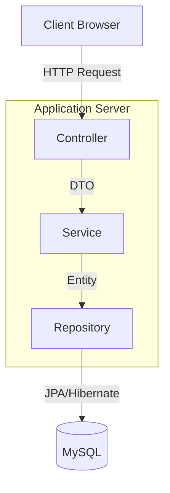

# Bandacsan - Website Quảng Bá & Kinh Doanh Đặc Sản Quê Hương

Chào mừng đến với dự án **Bandacsan**! Đây là ứng dụng web thương mại điện tử chuyên biệt, giúp kết nối người bán và người mua các sản phẩm đặc sản vùng miền.

## 1. Giới thiệu
Dự án được xây dựng dựa trên nền tảng **Java Spring Boot**, tuân thủ kiến trúc Layered Architecture và MVC. Hệ thống hỗ trợ đầy đủ các tính năng của một sàn TMĐT:
- **Người dùng**: Đăng ký/Đăng nhập, Xem sản phẩm, Giỏ hàng, Thanh toán (COD/VNPAY), Theo dõi đơn hàng, Đánh giá sản phẩm.
- **Người bán (Vendor)**: Quản lý cửa hàng, đăng sản phẩm, quản lý đơn hàng.
- **Admin**: Quản lý người dùng, kiểm duyệt nội dung, thống kê.

## 2. Yêu cầu hệ thống
Để chạy dự án, máy tính của bạn cần đáp ứng:
- **Java**: JDK 17 trở lên.
- **Maven**: 3.8.x trở lên.
- **Database**: MySQL 8.0 trở lên.
- **Python**: 3.x (để chạy script nạp dữ liệu).

## 3. Cài đặt & Cấu hình

### Bước 1: Clone repository
```bash
git clone <repository-url>
cd bandacsan
```

### Bước 2: Cấu hình Database
1. Tạo database tên `dbdacsan` trong MySQL (UTF-8).
2. Mở file `src/main/resources/application.properties`.
3. Cập nhật `spring.datasource.username` và `spring.datasource.password` tương ứng với MySQL của bạn.

### Bước 3: Nạp dữ liệu mẫu (Quan trọng)
Dự án đi kèm với bộ dữ liệu mẫu đầy đủ (Sản phẩm, User, Đánh giá, Ảnh). Hãy chạy lệnh sau để nạp dữ liệu:

**Cách 1: Sử dụng Script Python (Tự động)**
```bash
python doc/execute_sql.py
```
*Script này sẽ nạp `dbdacsan.sql` (cấu trúc & dữ liệu cơ bản) và `doc/insert_ratings.sql` (dữ liệu đánh giá).*

**Cách 2: Import thủ công**
1. Import file `dbdacsan.sql` vào database `dbdacsan`.
2. Import file `doc/insert_ratings.sql` (để có dữ liệu đánh giá).

## 4. Cách chạy dự án

### Cách 1: Sử dụng Script tự động (Khuyên dùng)
**Trên Windows (PowerShell):**
```powershell
.\run.ps1
```
Script sẽ tự động:
1. Kiểm tra Java và Maven.
2. Cho phép bạn chọn chế độ chạy (Dev Mode, Build & Run, Test).
3. Khởi động server tại `http://localhost:8080`.

### Cách 2: Sử dụng Maven
```bash
mvn spring-boot:run
```

## 5. Tài khoản Demo (Mật khẩu: 123456)
- **Admin**: `admin` / `123456`
- **Vendor**: `vendor` / `123456`
- **User**: `user` / `123456`

## 6. Kiến trúc hệ thống
Dự án sử dụng kiến trúc 3 tầng (3-Tier Architecture):



## 7. Đóng góp
Chúng tôi hoan nghênh mọi đóng góp! Vui lòng tạo Pull Request.

## 8. Liên hệ
- **Email**: contact@bandacsan.vn
- **Website**: https://bandacsan.vn

---
*Say hi ANCNT!*
